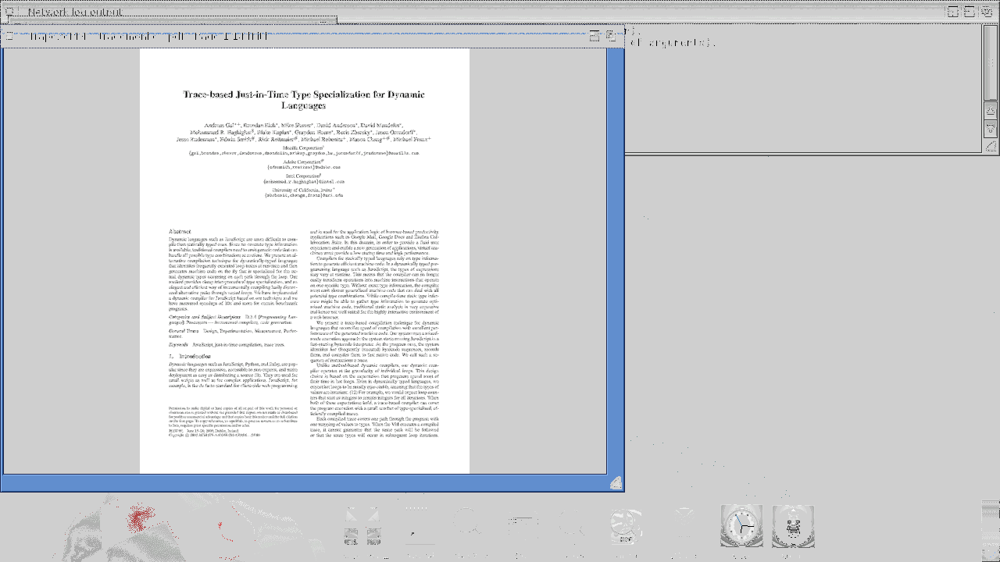
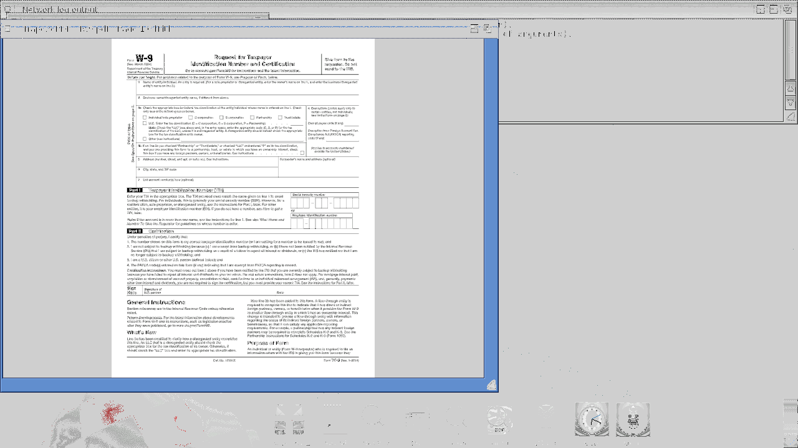

# TrapezePDF

A native PDF viewer for AmigaOS 4.1 PPC, built on MuPDF. By Chris
Collins.



## Status

**Alpha.** View, navigate, zoom, print, annotate, fill forms, and
manage pages — all functional on sam460ex-class hardware and QEMU.
Full v1.0 packaging (LHA archive, Installer, icon set) is still
being polished. See `docs/ROADMAP.md`.

## Features

- **View** any PDF from an AmigaDOS shell (`TrapezePDF file.pdf`),
  via **File → Open** (ASL requester), or directly from an
  **HTTPS URL** on the command line (see below).
- **Multi-page navigation** — PgUp/PgDown, arrows, Space, Home/End.
- **Zoom** — Fit Page (default), Fit Width, 100%, or ±25% nudge.
- **Print to PRT:** — File → Print sends the whole document to
  `PRT:` as PostScript; whichever printer driver is configured in
  Prefs handles the output.
- **Print to File** — File → Print to File… saves the same
  PostScript rendition to a user-chosen `.ps` path (useful for
  proofs, ghostscript conversion, or when no printer driver is
  configured).
- **Annotations** — sticky notes; delete all annotations on a page;
  save-as writes them back into the PDF.
- **Form fill** — list form fields on the current page and fill
  the next empty text field; save-as persists.
- **Page management** — rotate CW/CCW/180°, delete a page,
  extract a page to a new PDF.
- **Standard OS4 menu bar** (gadtools) — File / View / Page /
  Annotate / Form / Help.

Not yet implemented (post-v1.0):
- Text selection / copy
- Text search
- Thumbnail sidebar
- Interactive mouse annotation (drag-select highlight, freehand)

## Screenshots

### Command-line HTTPS launch

```
DH1:TrapezePDF https://raw.githubusercontent.com/mozilla/pdf.js/master/test/pdfs/tracemonkey.pdf
```

TrapezePDF parses the URL, shells out to `openssl s_client`, saves
the response body to `T:trapeze_download.pdf`, and opens it — no
intermediate manual download required.


Requirements for URL fetch:
- `openssl` binary at `DH1:openssl` (AmiSSL 5.27+ CLI).
- AmiSSL cert bundle at `DH1:AmiSSL/Certs/`.
- Working TCP/IP stack with a default route to the internet.

### Interactive PDF form (IRS W-9)

```
DH1:TrapezePDF DH1:fw9.pdf
```

Renders the two-column layout, checkboxes, and text-entry fields.
Use **Form → List Form Fields** to enumerate widgets on the current
page (prints their name, type, and current value to stderr), and
**Form → Fill Next Field…** to populate the next empty text field.



### Print to File (PostScript)

**File → Print to File…** opens an ASL save requester (defaulted to
`<pdfname>.ps` in the drawer of the source document). The full
document is written as PostScript to that path. The output is
identical to what `File → Print` would send to `PRT:`, so it's the
same content that a PS-capable printer or ghostscript would
process.

Useful for:
- Producing a PS proof without a configured OS4 printer driver.
- Converting to raster or another PDL via ghostscript on another
  machine (`ps2pdf`, `ps2raster`, etc.).
- Debugging what the print path actually emits.

## Building

Prereqs: Docker with `walkero/amigagccondocker:os4-gcc11` (auto-pulled by
our Dockerfile), ~2 GB free disk.

```
docker build -t pdfview-os4-build:local .
./scripts/fetch-mupdf.sh
./scripts/build.sh
```

Output: `build/pdfview-stripped` (~44 MB static ELF32 PPC, big-endian).

Unit tests (host, no Amiga needed):
```
./tests/run.sh
```
Covers URL parsing, HTTP request/response handling (including the
byte-exact Host-header + Content-Length fixes), POSIX shim functions
(memmem, timegm), and IFF/FTXT clipboard parsing.

## Deploying to a guest

Via `xdftool` (guest offline):
```
xdftool ~/AmigaOS4/amigaos4-dev.hdf write \
    build/pdfview-stripped TrapezePDF
```

Via the amiga_mcp bridge (guest booted, TCP mode over ethernet):
```
curl -X POST http://localhost:3000/api/transfer \
    -H 'Content-Type: application/json' \
    -d '{"source":"build/pdfview-stripped","dest":"DH1:TrapezePDF","direction":"push"}'
```

Over an ethernet-mode bridge (see amiga_mcp's `qemu-os4` profile),
the 43 MB transfer completes in ~2 minutes.

## Running

```
DH1:TrapezePDF                                ; empty window, use File → Open
DH1:TrapezePDF DH1:mydoc.pdf                  ; open local PDF at page 1
DH1:TrapezePDF https://example.com/doc.pdf    ; fetch + open via HTTPS
```

See `docs/USER_GUIDE.md` for the full keyboard reference, menu
tree, and per-feature notes.

## License

**AGPL-3.0** — matches MuPDF's license. Full text in `LICENSE`.

If you want to embed TrapezePDF (or MuPDF via TrapezePDF) in a
closed-source product, you also need a commercial MuPDF license
from Artifex Software: https://artifex.com/licensing/

## Attribution

- **TrapezePDF** © 2026 Chris Collins
- **MuPDF** © Artifex Software Inc. — https://mupdf.com
- Cross-compile toolchain: walkero's AmigaGCConDocker
